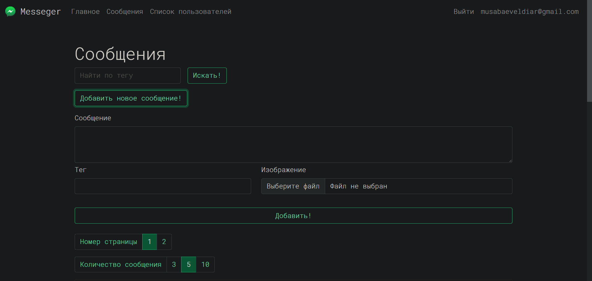

# Messager

---

По сути мой первый pet-проект. Представляет из себя этакий соц. сеть, 
где есть базовые и стандартные функции. Старался с душой, а 
благодаря **[Андрею](https://www.youtube.com/c/letsCodeDru/featured)** 
подтянул свои скиллы.

# Стэк

---

Технология                            |  Роль
-----------                           | -----------
Spring Boot                           | Основополагающая основа
MySQL                                 | СУБД
Hibernate                             | ORM
Thymeleaf                             | Шаблонизатор HTML
JUnit, AssertJ,   Hamster, Mockito | Тестирование
FlyWay                                | Миграция БД
Lombok                                | Генератор шаблонного кода
Gradle                                | Система сборки
Bootstrap 5                           | Оформление UI

# Чего я усвоил

---

* Усвоил на хорошем уровне Spring Boot, Spring Security
* MySQL прежде не использовал, но его Workbench меня порадовал
* Понял как писать более сложные представления в Thymeleaf
* Узнал о существований миграции БД и для чего они 
* Концепции HTTP, SMTP, REST API, servlet filter, DTO, сессии, 
аутенфикация и его виды
* Реализовал регистрацию и авторизацию на деле
* Пагинация, постраничное отоброжение данных
* Работа с почтовыми сервисами. Протокол SMTP, MimeMessage
* Оформление UI с помощью Bootstrap 5 
* Загрузка файлов в сервер и отображение оттуда. Протокол FTP
* Азы интеграционное и модульное тестирование. Mockito, Hamster...
* Логика с аккаунтами и ролями
* Логирование и его уровни
* И многое другое

# Время и объем работы

---

Разобрался со всем этим за 1 месяц. Кто знает, может, я быстрее 
закончил бы если не колледж

# Архитектура БД

---

# И скриншотики

---

